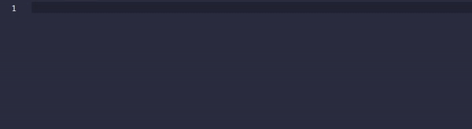
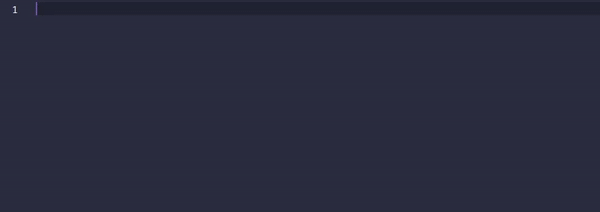

# Aimware Language Server

A Lua language server that supports the AIMWARE API, based on [lua-language-server](https://github.com/sumneko/lua-language-server).

## Showcase

## Issues
If you encounter any issues contact me on Discord: stacky#6580
